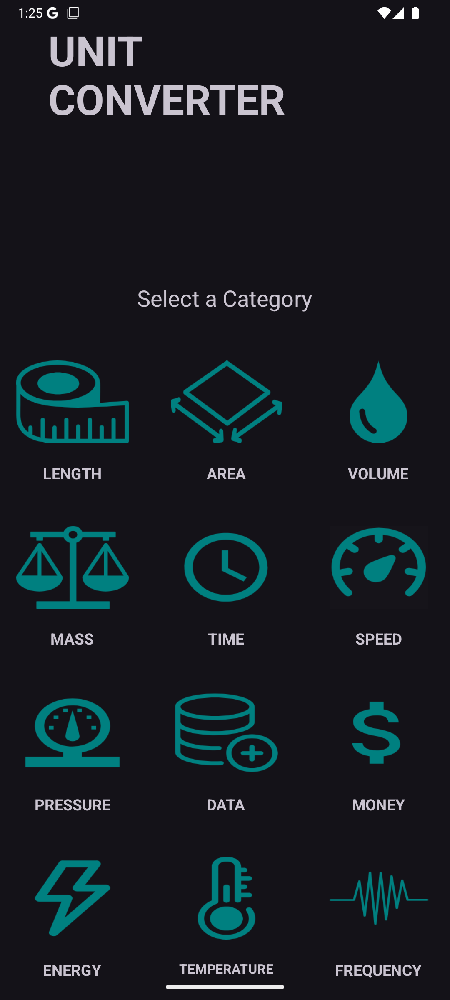
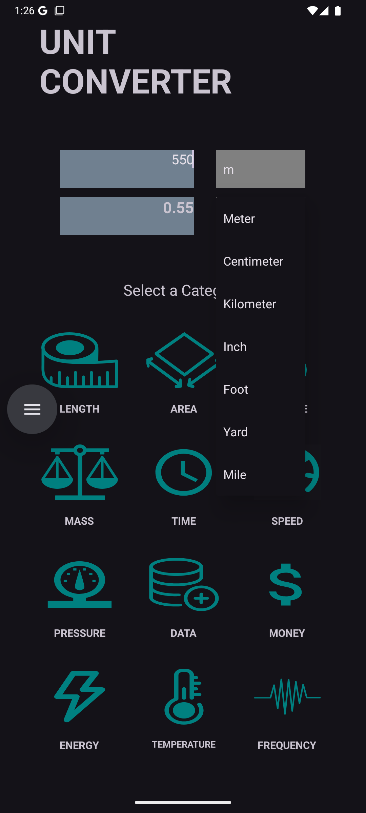
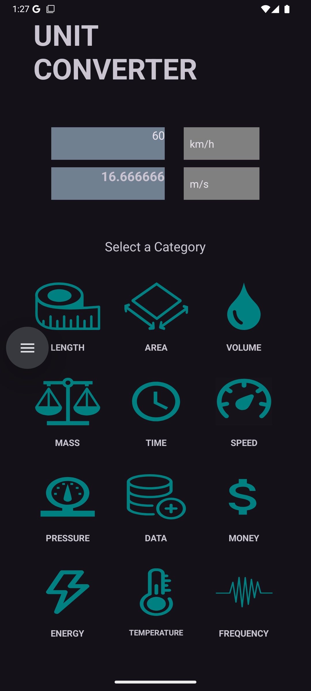
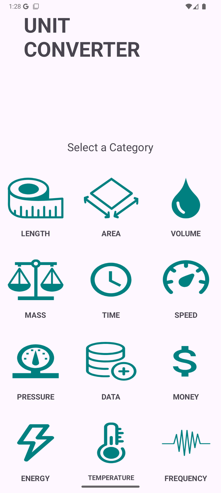
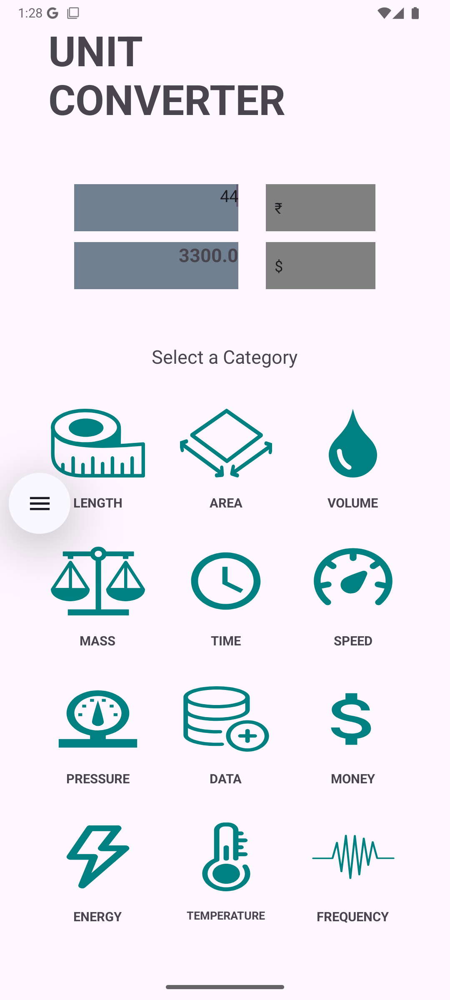

# 🛠️ Converter App

A powerful and easy-to-use Converter App that supports conversion between a wide range of units across multiple categories.

## Supported Unit Categories

- **Length** (centimeters, meters, kilometers, miles, feet, inches, yard)
- **Area** (square meters, Square Kilometers, square feet, etc.)
- **Volume** (liters, milliliters, cubic meters, etc.)
- **Time** (seconds, minutes, hours, days, weeks)
- **Mass** (kilograms, grams, pounds, ounces, etc.)
- **Speed** (meters per second, kilometers per hour, miles per hour)
- **Pressure** (pascals, bar, atmosphere, etc.)
- **Temperature** (Celsius, Fahrenheit, Kelvin)
- **Data** (bytes, kilobytes, megabytes, gigabytes, terabytes)
- **Frequency** (Hertz, kilohertz, megahertz, gigahertz, etc.)
- **Money** (supports multiple currencies with latest exchange rates)
- **Energy** (joules, kilowatt-hours, etc.)

## Features

- Easy conversion between units within each category
- Intuitive user interface
- Light and dark mode options

## Usage

1. Select the category (e.g. Length, Area, Volume, etc.).
2. Choose the units to convert from and to.
3. Enter the value to convert.
4. View the result instantly.

## 📸 Preview

- 

- 
  
- 

- 
  
- 
